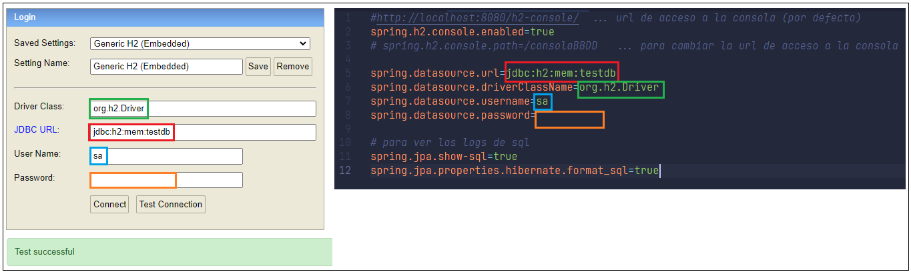
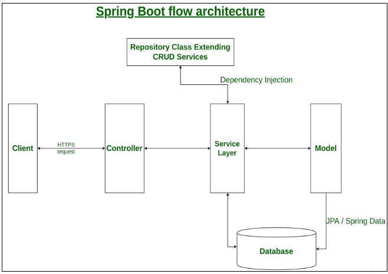

# Práctica 1 - Guía de desarrollo

[**_Ver enunciado_**](/Practica%201/Practica%201.pdf "Practica1.pdf")

### Objetivo del proyecto

&emsp;&emsp;
Crear un servicio web muy sencillo que nos permita realizar algunas operaciones básicas (CRUD) sobre una entidad **Persona**.

### Creación del proyecto

&emsp;&emsp;
Entre los prerequisitos para este punto se encuentran:

1. Tener instalado Java JDK 17.
    - Luego de completar la instalación ejecutamos: `java --version` para confirmar.
2. Tener instalado un entorno de desarrollo (IDE) de su preferencia (VsCode, Eclipse, IntellIJ, NetBeans, etc.).
3. Crear el repositorio asociado al proyecto en GitHub.
    - Crear una cuenta si no tenemos una o sino directamente ingresar y crear un repositorio nuevo.
4. Tener creada una cuenta de PostMan, ya que lo usaremos como aplicativo para probar nuestra API.

 &emsp;&emsp;
**Spring Initializr** 
&emsp;&emsp;
Crearemos nuestro proyecto utilizando el framewor SpringBoot, un subconjunto del framework Spring que permite una creación y configuración acelearada de proyectos web con Java. Para ello utilizaremos la herramienta [**Spring initializr**](https://start.spring.io/ "Herramienta de inicialización automática para proyectos SpringBoot"), que permite crear un proyecto Spring con una serie de dependencias básicas iniciales.

&emsp;&emsp;
Utilizaremos las opciones:

-   Project -> **Gradle - Groovy**
-   Language -> **Java**
-   Spring Boot -> **3.2.3** (Versiones 3.x.x requieren Java JDK 17)
-   Project Metadata
    -   Group -> **ar.edu.unlp.ppaas**
    -   Artifact -> **ejercicio1**
    -   Name -> **ejercicio1** (autogenerado a partir de Artifact)
    -   Description -> **patrones de arquitecturas de software - ejercicio 1**
    -   Package Name -> **ar.edu.unlp.ppaas.ejercicio1** (autogenerado dinámicamente a partir de los campos previos _[Group + Artifact]_)
-   Packaging -> **Jar**
-   Java -> **17**

&emsp;&emsp;
En la sección de la derecha (Dependencies) agregaremos:

-   **Spring Web**
    -   Que nos permitirá crear aplicaciones Spring respetando el patrón MVC e incorpora el servidor de aplicaciones Apache Tomcat.
-   **Spring Data JPA**
    -   Que nos permitirá utilizar Java Persistence API, además de Hibernate.
-   **H2 Database**
    -   Que nos permitirá mantener y gestinoar una BBDD en memoria, configurable mediante nuestro browser.
-   **Spring Boot DevTools** (Opcional)
    -   Que nos permitirá el reinicio rápido de nuestra aplicación, recarga en vivo luego de realizar cambios y una más amena experiencie de desarrollo.
-   **Lombok** (Opcional)
    -   Que nos permitirá reducir código repetitivo en nuestro proyecto, manteniendo código mucho más liviano.

Finalmente generamos el proyecto Spring, seleccionando: &emsp;
<button style="background-color: rgb(109, 179, 10); color: black; letter-spacing: 1px;">**GENERATE**</button> 
Esto nos descargará un archivo comprimido (\*.zip) con nuestro proyecto.
Procedemos a descomprimirlo, copiarlo en el directorio de nuestra preferencia y abrir el proyecto, utilizando nuestro IDE.

 

### Instalación de dependencias, compilación y ejecución del proyecto

&emsp;&emsp;
Ya que disponemos de la herramienta Gradle podemos ejecutar los comandos asociados. &emsp;&emsp;
Asumimos que para la ejecución de todos los comandos, el directorio actual es la raíz del proyecto.

-   `./gradlew clean build` para limpiar y construir nuestro proyecto. Como resultado se crea el subdirectorio /build en nuestro proyecto.  
-   `./gradlew bootRun` para ejecutar nuestro proyecto. Como resultado la consola muestra las etapas de la ejecución y nuestro servidor es accesible en el puerto 8080 de nuestro servidor local. Mediante la url: [**_https://localhost:8080_**](https://localhost:8080/)

 

### Configuración del proyecto

&emsp;
Utilizaremos como base de datos, el motor H2, que se caracteriza por su velocidad, es de código abierto basado en JDBC API, administrable mediante una consola basada en browser y puede utilizarce como BBDD embebida en memoria del servidor.

Configuración a la BBDD H2:

1. Incorporaremos el motor H2 mediante la dependencia asociada (grupo: com.h2database artefacto: h2 alcance: runtime).

    1. Esta dependencia fue incorporada como una dependencia de arranque indicada mediante el aplicativo initialzr.
    2. La url asociada para la administración es (por defecto): http://localhost:8080/h2-console
        1. Dicha url puede configurarse en el archivo application.properties mediante: **spring.h2.console.path=[/ruta]**
            Ejemplo: si queremos consultarla con la url: **_http://localhost.8080/consolaBBDD_** configuraríamos: `spring.h2.console.path=/consolaBBDD`

2. Todo proyecto Spring tiene un archivo de configuración **application.properties**, que contiene todas las configuraciones necesarias para su correcto funcionamiento. Éste archivo puede verse en el directorio **./src/main/resources/** del proyecto.
    - En nuestro caso para la configuración inicial de la BBDD H2, proporcionamos un [**application.properties**](./application.properties "Archivo de configuración del proyecto") como ejemplo.
3. Verifique que todos y cada uno de los parámetros configurados en el archivo, es decir, que cada parámetro coincida con los mostrados en la consola de configuración de H2 (específicamente: Driver Class, JDBC URL, User Name y Password).
 <figure>
 
 <figcaption>Coincidencia entre parametrización de configuración H2 y consola de pruebas.</figcaption>
 </figure>

-   Verifique la conexión mediante el botón **Test Connection**
-   Verifique el ingreso mediante el botón **Connect**

 

### Arquitectura del proyecto

&emsp;
El proyecto se estructura siguiendo la arquitectura de capas, bajo un patrón Modelo Vista Controlador (MVC) propuesto por Spring.

 <figure>
 
 <figcaption>Lineamiento general de la arquitectura propuesta por Spring.</figcaption>
 </figure>

-   ### Capa de datos (BBDD)

    Esta capa contiene todas las bases de datos de la aplicación, en nuestro caso sólo la BBDD H2 persistida en la memoria del servidor (un Apache Tomcat corriendo en el puerto 8080). 
    No tiene específicamente un subdirectorio asociado en el proyecto ni una anotación que la represente porque está manejada por el DBMS, Spring Data Jpa y el ORM Hibernate.

-   ### Capa de Modelo de Datos

    Esta capa de la aplicación es la que se encarga de los artefactos, conocidos aquí como **Entidades**, más cercanos a la BBDD. Aquí se define la estructura de cada entidad del modelo de datos, representada por sus atributos y las anotaciones que los etiquetan. 
    &emsp;Representada por el subdirectorio: `./model` 
    &emsp;Anotación asociada: `@Entity`

-   ### Capa de Repositorios

    Esta capa de la aplicación es la que se encarga de reutilizar la funcionalidad ya provista por el framework Spring, en cuanto a las operaciones básicas sobre nuestra BBDD, es decir, las relativas a las operaciones CRUD (Creacion, Lectura, Actualización y Eliminación). Esto es posible mediante herencia, ya que cada repositorio de nuestra aplicación heredará de la clase **JpaRepository**. 
    &emsp;Representada por el subdirectorio: `./repository` 
    &emsp;Anotación asociada: `@Repository`

-   ### Capa de Servicios

    Esta capa de la aplicación contiene todo lo relativo a la lógica del negocio. Cada clase de servicio suele inyectar la dependencia al repositorio asociado que le permitirá la invocación de toda la lógica relativa a los CRUDs. Las operaciones que cada servicio añade suelen estar delcaradas en una interface asociada, la cuál el servicio implementa. 
    &emsp;Representada por el subdirectorio: `./service` 
    &emsp;Anotación asociada: `@Service`

-   ### Capa de Controladores

    Esta capa de la aplicación contiene todo lo relativo a los puntos o métodos de invocación (endpoints) que serán ejecutables desde un browser o cualquier cliente web o servicio externo. 
    &emsp;Representada por el subdirectorio: `./controller` 
    &emsp;Anotación asociada: `@RestController`

 

### Agregando la entidad 'Persona' a nuestro modelo de datos

-   Cree un subdirectorio **_/model_**, éste contedrá todas las clases asociadas a nuestro modelo.
    -   Notación recomendada para cada clase definida en este paquete: _nombreEntidad**Model**.java_, siendo "nombre" el nombre de la clase. Por ejemplo, para la entidad **Persona** definiríamos: . _/model/**PersonaModel.java**_
-   Crear la entidad del modelo de datos **Persona**, definiendo una clase que contenga, al menos, los siguientes atributos:
    -   Id
    -   Apellidos y nombres
    -   Fecha de nacimiento
    -   Email
-   Crear para cada atributo definido, los getters y setters.
-   Crear al menos 2 constructores asociadosm (sin atributos parametrizados y con todos los atributos parametrizados).
-   Es posible utilizar **_Lombok_**, mediante anotaciones para tal fin (investigar: _@NoArgsConstructor_ _@AllArgsConstructor_
    _@Getter_ _@Setter_).
-   Crear una clase <a id="dto_persona">**DTO** para la entidad **Persona**</a> que contenga los siguientes atributos:

    -   Id
    -   Nombre completo -> que surge de la concatenación de apellidos y nombres, con formato: [apellidos, nombres].
    -   Edad -> calculada a partir de los años transcurridos desde la fecha de nacimiento.
    -   Email

    &emsp;&emsp; **_Tip_**: tenga en cuenta que este objeto, por definición, no debería contener nada relativo a la lógica del negocio sino simplemente funcionalidad asociada al almacenamiento y recuperación de datos.

 

### Agregando el repositorio 'Persona'

-   Defina un <a id="repositorio">repositorio JPA para las personas</a>, mediante la creación de una interface que extienda de alguna de las provistas por el framework. De este modo nuestras clases utilizarán el rpositorio mediante la implementación de esta interface que contendrá implementaciones por defecto para los CRUDs.
    -   En nuestro caso extenderemos desde la clase **JpaRepository<T, id>**
    -   Existen varios tipos de repositorios más en la jerarquía, por ejemplo **PagingAndSortingRepository**, que cómo su nombre indica permite implementar queries a la BD considerando paginación y ordenamiento.

 

### Agregando el los servicios asociados a la 'Persona'

-   Defina un servicio encargado de transformar (mapping) una entidad de la BBDD (DAO) en el [DTO que definimos previamente](#dto_persona).

    -   Es posible hacerlo manualmente o recurrir a una librería para tal fin, como por ejemplo: **MapStruct**. 

-   Defina otro <a id="servicio">servicio</a> que contendrá las operaciones exportadas por el servicio web.
    -   Dar de alta una nueva persona en el sistema (**CREATE**)
    -   Obtener el listado de todas las personas del sistema (**READ** (N))
    -   Obtener una persona determinada dentro del sistema (**READ** (1))
    -   Actualizar una persona del sistema (**UPDATE**)
    -   Eliminar una persona del sistema (**DELETE**) 

&emsp;&emsp; **_Tips_**:  &emsp;&emsp;&emsp;&emsp; - Recuerde etiquetar ambas clases con la anotación **@Service** para registrarlas en Spring. &emsp;&emsp;&emsp;&emsp; - Las operaciones que cada servicio debe implementar deberían estar definidas en una interface asociada. &emsp;&emsp;&emsp;&emsp; - Recordar usar la etiqueta **@Autowired** en estos servicios, para inyectar las dependencias necesarias. Por ejemplo, el servicio que define los CRUDs, requerirá la inyección del [repositorio creado](#repositorio). 

 

### Creando el controlador asociado a la 'Persona'

-   Crear un controlador donde se definan los puntos de acceso (_endpoints_) para las operaciones que exportará el srvicio.

&emsp;&emsp; **_Tips_**:  &emsp;&emsp;&emsp;&emsp; - Recuerde etiquetar ambas clases con la anotación **@RestController** para registrarlas en Spring. &emsp;&emsp;&emsp;&emsp; - Recordar usar la etiqueta **@Autowired** cuando lo requiera, para inyectar las dependencias necesarias. Por ejemplo, el controlador requerirá la inyección del [servicio creado](#servicio) para implementar cada funcionalidad expuesta por un punto de acceso. &emsp;&emsp;&emsp;&emsp; - Considerar criterios REST (rutas, verbos HTTP, etc.). 

 

### Inicializando los datos asociados a las entidades 'Persona'

Dado que nuestra BBDD gestionada por H2 es mantenida en memoria del servidor, la misma es recreada cada vez que compilamos y ejecutamos nuestro servicio web. Por consiguiente, si deseamos visualizar y trabajar con datos para pruebas necesitaríamos incorporárselos previamente.

-   Crear un inicializador que cargue algunos datos de prueba (con 3 o 4 personas será suficiente). Esto se logra definiendo un servicio que implemente la interfaz **ApplicationRunner**. Allí, se inyecta el repositorio y se lo usa para dar de alta Personas en el sistema.

 

### Dockerización del proyecto

&emsp;
Docker es una herramienta ... su proposito es ...

En el directorio raíz de nuestro proyecto debemos crear un archivo de configuración para Docker. Aquí puedes visalizar un ejemplo de dicho archivo para nuestro proyecto, asegúrate que su nombre sea [**dockerfile**](/Practica%201/dockerfile) y que el directorio sea el correcto. 

&emsp;Tips del archivo **dockerfile**:

-   nombre: **dockerfile** o **Dockerfile** sin extensión alguna.
-   ubicación: al mismo nivel que la carpeta **/src** y **/build**

&emsp;Comandos:

-   **Construcción** de la imagen
    -   Formato genérico: `docker build -t org/aplicacion:version .` 
    -   En nuestra aplicación: `docker build -t pas/ejercicio1:1.0.0 .` 
    -   Resultado: una nueva imagen del proyecto generada con Docker 
        -   Visualizable mediante el comando: `docker list`  
-   **Ejecución** del contenedor: `docker run -p 8080:8080 pas/ejercicio1:1.0.0`
    -   Luego de su ejecución, si todo sale bien, la aplicación correrá en el puerto 8080, y será accesible mediante la url: [**_https://localhost:8080_**](https://localhost:8080/)

 

### Repositorios colaborativos

Para la administración de nuestro código, que nos permita trabajar de forma distribuída y colaborativa, utilizaremos **GitHub** o **GitLab**, dos ultra conocidos clientes de **Git**.

-   Registrarse como usuario (si no lo estás aún). 
-   Crear el repositorio asociado al proyecto.  
-   Añadir colaboradores al proyecto (miembros de tu grupo).  
-   Docker
    -   (GitLab) En la sección **Packages and registries > Container registry**. Puede accederse al registro de imágenes docker del proyecto. El mimso contiene las instrucciones para loguearse y subir una imagen Docker al mismo. 
    -   (GitHub) ... 

 

### Fuentes Relacionadas

&emsp; 
&emsp; 
&emsp;
&emsp;
&emsp; 
&emsp;
&emsp; 
&emsp; 
&emsp; 
&emsp; 
&emsp;
&emsp; 
&emsp; 
&emsp;
&emsp; 
&emsp; 
&emsp; 
&emsp;
&emsp; 
&emsp; 
 

### Contacto

&emsp;
&emsp;
&emsp;
