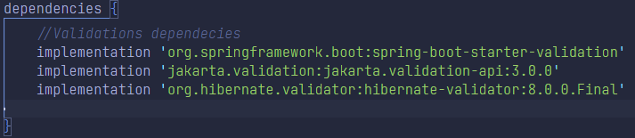

# Práctica 2 - Guía de desarrollo

[**_Ver enunciado_**](/Practica%202/Practica%202.pdf "Practica2.pdf")

### Objetivo

&emsp;
Incrementar la funcionalidad de nuestro proyecto web, a partir de la incorporación de las siguientes características:  

-   **Validación de datos** a las entidades.
-   **Asociaciones** (relaciones) entre entidades del dominio.
-   **Seguridad** para el acceso a los endpoints. 

### Implementando validaciones de datos sobre el proyecto

&emsp;&emsp;
Para la implementación de nuestras validaciones de datos, recurriremos a la utilización de la dependencia **jakarta**, que permite entre otras funcionalidades, la utilización de etiquetas para indicar diferentes restricciones sobre los datos.

1. Para utilizar este paquete debemos agregar en la sección **dependencies** del archivo `build.gradle` ubicado en el directorio raíz del proyecto, las dependencias asociadas a **spring-boot-starter-validation** y **jakarta-validation-api**.
 <figure>
  
  </figure>

&emsp;&emsp;&emsp;
Tener en cuenta que luego de agregar cualquier dependencia al proyecto siempre debemos limpiar y reconstruir la aplicación mediante: `./gradlew clean build` 
&emsp;&emsp;&emsp;
La documentación asociada al [_**uso de jakarta**_](https://beanvalidation.org/2.0/spec/ "Información sobre Jakarta") y al [_**validaciones básicas**_](https://www.baeldung.com/java-validation "Validaciones básicas Jakarta") y la [_**lista completa de validaciones**_](https://beanvalidation.org/2.0/spec/#builtinconstraints "Lista de validaciones Jakarta").

2. Es posible (y recomendable) también configurar un **manejador de excepciones** para que muestre mensajes más representativos y concisos ante cada invocación.
   La documentación asociada a la [_**configuración del manejador de excepcioens**_](https://www.baeldung.com/spring-boot-bean-validation "Manejador de excepciones").

3. Utilizaremos las validaciones en los controladores, mediante la anotación **@Valid**, tal y como se indica en este [_**ejemplo**_](https://www.baeldung.com/spring-boot-bean-validation#implementing-a-rest-controller "Ejemplo uso @Valid").

 

### Asociaciando personas y direcciones

1. Crear la entidad **Direccion**, con los siguientes atributos:

    - **Calle** -> no admite null.
    - **Número** -> no admite null.
    - **Piso** -> no admite null.
    - **Departamento** -> no admite null.
    - **Localidad** -> no admite null.
    - **Provincia** -> no admite null.
    - **País** -> no admite null.

2. Actualizar la entidad **Persona**, con las siguientes validaciones:

    - **Apellido** -> no admite null.
    - **Nombre** -> no admite null.
    - **Fecha de Nacimiento** -> no admite null.
    - **Email** -> no admite null.

3. Verificar todas y cada una de las validaciones implementadas mediante **PostMan** o cualquier librería o extensión para tal fin.

4. Actualizar el dominio para manejar la relación entre cada persona y sus direcciones asociadas de envío (debe tener al menos una) y su dirección de facturación (debe obligatoriamente tener una).
    - En los siguientes enlaces tenemos más información sobre este tema:
        - [_**uso de jakarta**_](https://beanvalidation.org/2.0/spec/ "Información sobre Jakarta")
        - [_**validaciones básicas**_](https://www.baeldung.com/java-validation "Validaciones básicas Jakarta")
        - [_**lista completa de validaciones**_](https://beanvalidation.org/2.0/spec/#builtinconstraints "Lista de validaciones Jakarta").
        - [_**lista completa de validaciones**_](https://beanvalidation.org/2.0/spec/#builtinconstraints "Lista de validaciones Jakarta").

 

### Implementando autenticación y autorización al proyecto

&emsp;&emsp;
Implementar mediante **JSON Web Token** (JWT), la autenticación y autorización para cada invocación de los servicios REST expuestos.
Para ello, inicialmente consideraremos únicamente dos roles posibles:

-   **USER** -> sólo puede realizar lectura sobre los datos.
-   **ADMIN** -> puede realizar lectura y escritura sobre los datos.  
**_Nota_**: Considere utilizar como _username_ el **email** de las personas.

 

### Fuentes Relacionadas

&emsp; 
&emsp; 
&emsp; 
&emsp; 
&emsp; 

 

### Contacto

&emsp;
&emsp;
&emsp;
